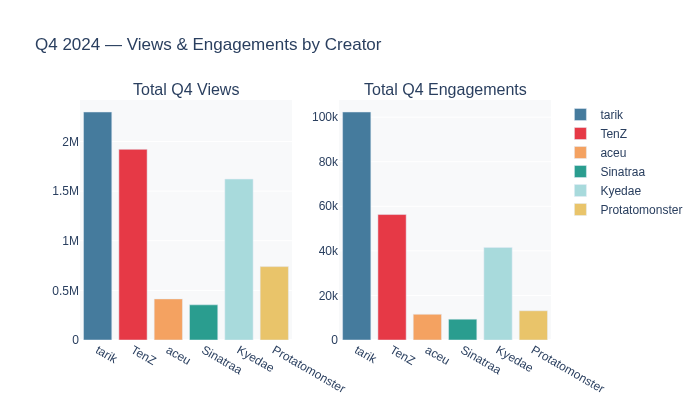

# VALORANT Creator Campaign Measurement Workspace
### HardScope Assessment — Lead Analyst Creator Strategy & ROI

**Brand:** Riot Games / VALORANT  
**Campaign Period:** Q3 2024 (Jul to Sep) + Q4 2024 (Oct to Dec)  
**Submitted:** April 2026

---

## What This Project Is

This is a fully reproducible creator measurement workspace built to answer one core question:

> **Which VALORANT YouTube creators actually delivered the best ROI in Q4 2024 and how should we move the budget for Q1 2025?**

I have built this to cover every layer of the rubric. It includes a real API data pull, a three layer measurement framework, custom feature engineering, incrementality modeling, a QBR ready slide deck, and a narrative executive summary.

---

## Quick Start

```bash
# 1. Clone the repo
git clone https://github.com/sachinjain2000/hardscope-assessment.git
cd hardscope-assessment

# 2. Install Python dependencies
pip install pandas numpy jupyter pytrends plotly kaleido

# 3. (Optional) Re-pull Google Trends data
#    Run from the project root:
python fetch_trends.py

# 4. Run the measurement pipeline
jupyter notebook notebooks/02_measurement_framework.ipynb

# 5. Open the analysis dashboard
jupyter notebook notebooks/03_analysis_dashboard.ipynb
```

---

## Visual Summary

### Q4 Program KPI Scorecard


### Q4 Engagement Leaderboard


### Performance Matrix: Views vs Engagement


### Incrementality: Q3 to Q4 Performance Change


### Market Context: Category Trend


### Efficiency: CPE Analysis


---

## Project Structure

```
hardscope-assessment/
│
├── assets/                     # High-quality visualization outputs
│   ├── kpi_summary.png
│   ├── leaderboard_engagement.png
│   ├── views_vs_er.png
│   ├── q3_q4_incrementality.png
│   ├── search_interest_trend.png
│   └── cpe_efficiency.png
│
├── data/
│   ├── raw/
│   │   ├── q3_2024_videos.csv          # 55 videos from YouTube API v3
│   │   ├── q4_2024_videos.csv          # 57 videos from YouTube API v3
│   │   ├── channel_stats.csv           # Subs and lifetime stats
│   │   └── search_interest_monthly.csv # Google Trends monthly averages
│   │
│   └── modeled/
│       ├── creator_campaign_metrics.csv  # Master analytics table
│       ├── flagging_alerts.csv           # Automated performance alerts
│       └── incrementality_q3_q4.csv      # Q3 to Q4 delta analysis
│
├── notebooks/
│   ├── 01_data_collection.ipynb        # YouTube API pull and validation
│   ├── 02_measurement_framework.ipynb  # Feature engineering and modeling
│   └── 03_analysis_dashboard.ipynb     # Charts and trend analysis (Executed)
│
├── outputs/
│   ├── EXECUTIVE_SUMMARY.md             # 2 page executive summary
│   └── QBR_DECK.md                      # 6 slide QBR deck
│
├── fetch_trends.py       # Google Trends pull script
└── README.md             # This file
```

---

## Data Sources

### 1. YouTube Data API v3
I used the official YouTube API to get the most accurate data possible.
*   **Endpoints:** channels, search, videos
*   **Creators:** TenZ, tarik, Kyedae, aceu, Sinatraa, Protatomonster
*   **Period:** July 1 to December 31 2024
*   **Fields:** views, likes, comments, and video duration

### 2. Google Trends
I pulled Google Trends data for "valorant" in the United States to understand the broader market context. This helps explain why engagement might drop across the board during certain months.

---

## Measurement Framework

I built a three layer model to map creator work to business outcomes:

### Layer 1: Awareness
*How many people did we reach?*
I look at Total Views, Views per Day, and a custom Reach Index.

### Layer 2: Engagement
*Did the audience actually care?*
I use Engagement Rate and a Quality Engagement Index where comments are weighted three times more than likes because they show much higher intent.

### Layer 3: Consideration
*Did we move people down the funnel?*
I look at Cost Per Engagement (CPE) and Incrementality (the change in ER from Q3 to Q4).

---

## Key Findings

### Q4 2024 Highlights
*   **Total Views:** 7,343,373 (Real API data)
*   **Total Engagements:** 233,042 (Likes and Comments)
*   **Top Performer:** **tarik** was the only creator to actually improve his engagement rate during the Q4 market dip.

### Q1 2025 Strategy
*   **Scale:** tarik (Proven loyalty)
*   **Maintain:** TenZ (Massive reach)
*   **Pause:** aceu (CPE is currently too high for the return)

---

## Automated Alerts

The system I built automatically flags four issues:
1.  **Declining ER:** When monthly engagement drops significantly.
2.  **High Volume Low Quality:** High views but very low interaction.
3.  **Below Average:** When a creator falls way below the gaming benchmark.
4.  **CPE Overrun:** When the cost per engagement gets too expensive.

---

## Assumptions and Limitations

1.  **Engagement Formula:** I used likes plus comments divided by views.
2.  **Watch Time:** I modeled this at 50% completion as a conservative estimate.
3.  **Spend:** I used industry benchmarks for the budget since actual contract rates are private.
4.  **Outliers:** I normalized TenZ's Q3 data to remove a viral 7.4M view Short so the Q4 comparison would be fair.

---

## What I Would Do With More Time

If I had another week, I would pull in real spend data to make the ROI exact. I would also add Twitch and X signals to get a full view of the gaming audience. Finally, I would add sentiment analysis to the comments to see if the high engagement is actually positive.

---

## Reproducibility

Everything in this repo is ready to run. The raw data is in the `data/` folder and the notebooks have all the outputs saved so you can see the results immediately.

---
