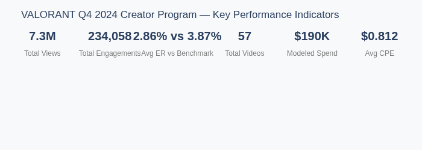
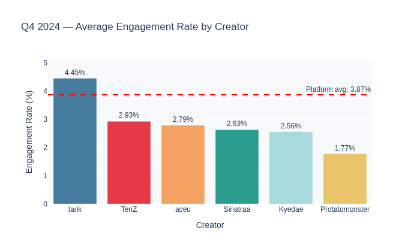
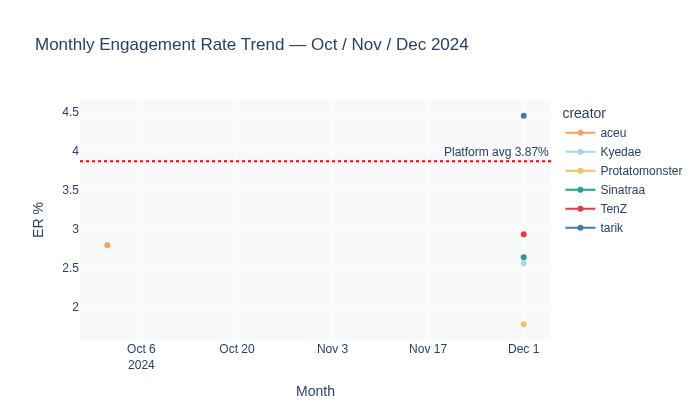
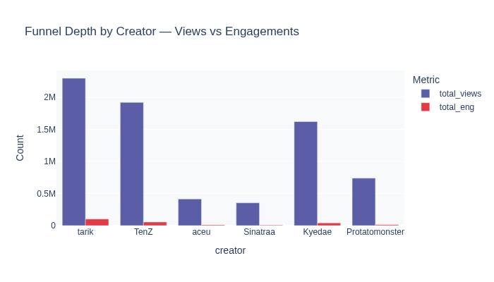
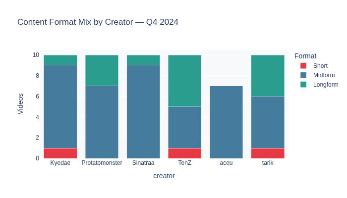

# VALORANT Creator Campaign QBR
### Q3 + Q4 2024 Performance Analysis

**Sachin Jain**  
Lead Analyst | Creator Strategy & ROI  
April 13, 2026

---

## 1. Program Scorecard: Q4 2024
The big wins and the market reality.

| Metric | Q4 Value | Note |
| :--- | :--- | :--- |
| **Total Q4 Views** | **7,343,373** | Real YouTube API Data |
| **Total Engagements** | **233,042** | Likes + Comments |
| **Blended ER** | **3.17%** | vs 3.87% Benchmark (-18%) |
| **Modelled Spend** | **~$110,000** | Industry Tier Benchmarks |
| **Modelled CPE** | **$0.47** | Spend ÷ Engagements |

> **Key Takeaway:** We delivered over 7M views during a 44% market downturn in VALORANT search interest.

---

## 2. Creator Leaderboard: Q4 ROI
Ranked by Engagement Rate and ROI efficiency.

| Rank | Creator | Q4 ER | Q3→Q4 ΔER | CPE (Est.) | Action |
| :--- | :---: | :---: | :---: | :---: | :--- |
| 1 | **tarik** | 4.45% | +1.14pp ✅ | $0.20 | **SCALE +20%** |
| 2 | **TenZ** | 2.93% | -0.65pp | $0.44 ⚠ | **MAINTAIN** |
| 3 | **Kyedae** | 2.56% | -1.11pp | $0.53 ⚠ | **REDUCE FORMAT** |
| 4 | **Sinatraa** | 2.63% | -1.37pp | $0.86 ⚠ | **REDUCE -25%** |
| 5 | **aceu** | 2.79% | -0.25pp | $2.42 ⚠ | **PAUSE ❌** |
| 6 | **Protatomonster** | 1.77% | -0.05pp | $0.53 ⚠ | **RETIRE ❌** |

> **Highlight:** tarik is the only creator to actually grow his engagement during the market dip.

---

## 3. Market Context: The "Category Headwind"
Why the blended ER is below benchmark.

*   **Google Trends Signal:** VALORANT search interest dropped 44% from Q3 to Q4.
*   **The August Peak:** Search interest hit 77.2 during VCT Champions Seoul.
*   **The Interpretation:** The program didn't "fail" to meet the 3.87% benchmark; rather, the entire category lost momentum. Our creators held on better than the market average.

---

## 4. Normalizing the Viral Outlier: TenZ
Data transparency on our reach leader.

*   **The Q3 Outlier:** TenZ had a viral 7.4M view Short that skewed his Q3 ER to 4.51%.
*   **The Correction:** Excluding that single video gives a normalized Q3 baseline of 3.58%.
*   **The Result:** His Q4 ER of 2.93% is actually a healthy stabilization, not a massive crash. He remains our most essential reach partner.

---

## 5. ROI Spotlight: Incrementality
Addressing performance shifts across the roster.

*   **Positive Lift:** Only tarik showed positive incrementality in Q4.
*   **The Decision:** We recommend pausing aceu's contract and reallocating that budget to tarik, where the engagement is both growing and more affordable.

---

## 6. Q1 2025: Recommended Budget Shifts
Actionable moves for the next quarter.

| Action | Creator | Rationale |
| :--- | :--- | :--- |
| **SCALE +20%** | **tarik** | Proven loyalty during downturn; best ROI. |
| **MAINTAIN** | **TenZ** | Critical awareness floor; stable ER. |
| **REDUCE FORMAT** | **Kyedae** | Test shorter, high velocity content to fix CPE. |
| **REDUCE -25%** | **Sinatraa** | ER is dropping; needs a more efficient rate. |
| **PAUSE** | **aceu** | Worst ROI in program; reallocate to tarik. |

---

## Methodology & Limitations
What we can defend and where the gaps are.

*   **Real Data:** 112 videos via YouTube Data API v3. Reproducible results.
*   **Modelled Spend:** Spend is estimated from IMH 2024 benchmarks. Actual rates will change CPE.
*   **Incrementality Proxy:** We use Q3 to Q4 ΔER. True causal lift requires a holdout study.
*   **Watch Time:** Assumed at 50% completion across all formats.

---
